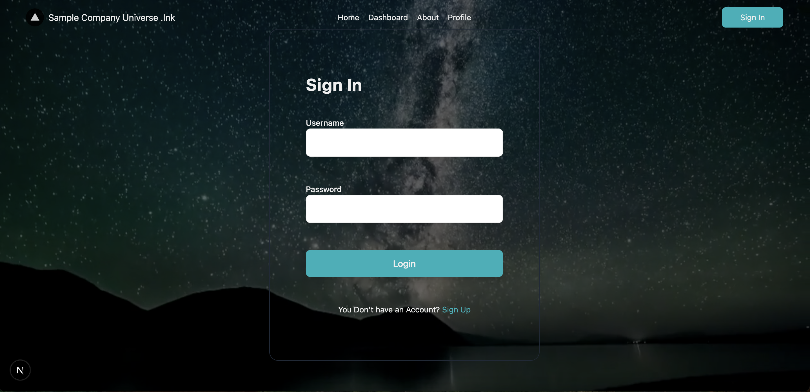
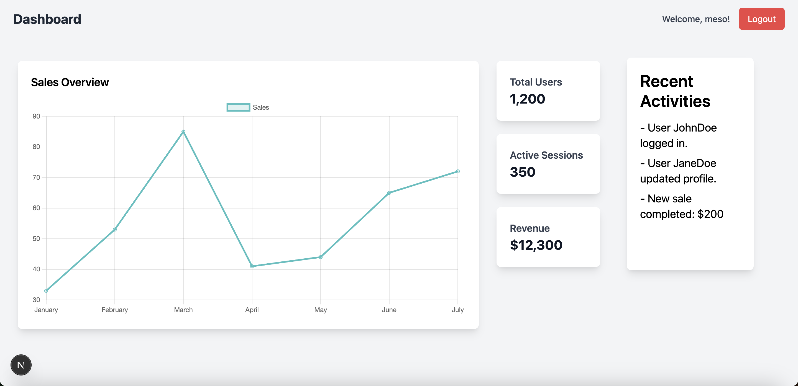

# Next.js Dashboard Project with Django Backend

This project demonstrates a simple **user authentication system** built with **Django** and **Next.js**, using **JWT tokens** for secure login and **session storage** for automatic login. It is designed for practicing **Django Rest Framework (DRF)** and **JWT authentication**.

## Features

- **User Authentication**: Secure login system using JWT tokens.
- **Automatic Login**: After login, the JWT token is stored in sessionStorage for persistent authentication across page reloads.
- **Dashboard**: A user dashboard is shown once the user is logged in, displaying their username.
- **Logout**: Ability to log out and clear the session storage, redirecting the user to the login page.

## Technologies Used

- **Frontend**:
  - **Next.js**: React framework for building the user interface.
  - **Tailwind CSS**: For styling the components with utility-first CSS.
  - **Axios**: To make API requests to the Django backend.

- **Backend**:
  - **Django**: Python framework for building the backend.
  - **Django Rest Framework (DRF)**: To handle API requests and authentication.
  - **JWT Authentication**: Implemented using `djangorestframework-simplejwt` to provide secure token-based authentication.
  
- **Other**:
  - **sessionStorage**: For storing JWT tokens on the client-side, allowing automatic login even after page reloads.

## Pages and Screenshots

### 1. **Login Page**

The login page allows users to log in by entering their username and password. Upon successful authentication, a JWT token is generated and stored in sessionStorage.



### 2. **Dashboard**

Once logged in, the user is redirected to the dashboard. The dashboard displays a welcome message with the username and a logout button. The user can log out to clear session storage and return to the login page.



### 3. **Registration Page**

Users can register a new account by providing a unique username and password. The registration page allows the creation of new users, and upon success, the user can log in using the credentials they just created.


## Installation

1. Clone the repository:
   ```bash
   git clone https://github.com/yourusername/your-repo-name.git
2. Navigate to the project directory:
   ```bash
    cd your-repo-name
3. Install dependencies for the frontend:
   ```bash  
    npm install
4. Install dependencies for the backend:
    Follow the instructions to set up a Django project and install dependencies.

5. Set up your Django project:
   ```bash
    django-admin startproject backend
    cd backend
6. Install required Python packages:
   ```bash
    pip install django djangorestframework djangorestframework-simplejwt
7. Set up environment variables and configure your Django backend:
    Add JWT authentication settings to your settings.py.
    Configure CORS to allow communication between your frontend and backend.

8. Run both the frontend and backend:
    For the frontend (Next.js):
    ```bash
    npm run dev
9. For the backend (Django):
    ```bash
    python manage.py runserver
## How It Works

### Frontend
The frontend is built with **Next.js**. It uses **React hooks** to manage state and **Axios** for making API requests.

- **Login**: When the user submits the login form, the username and password are sent to the backend. If the credentials are correct, the server generates an access token and a refresh token, which are stored in `sessionStorage` for persistent login.

- **Automatic Login**: The application checks if a token is present in `sessionStorage`. If found, the user is automatically logged in, and their username is displayed in the dashboard.

- **Logout**: When the user clicks on the logout button, the tokens are removed from `sessionStorage`, and the user is redirected to the login page.

### Backend
The backend is built with **Django** and **Django Rest Framework (DRF)**. The following key features are implemented:

- **JWT Authentication**: Using **djangorestframework-simplejwt**, the backend issues JWT tokens upon successful user login.

- **Register**: Users can register with a unique username and password, which is hashed and stored in the database.

- **Login**: After registration, users can log in, and the backend will generate an access token for authentication.

Once the user is authenticated, the access token is returned to the frontend and saved in `sessionStorage`.

## API Endpoints

### POST /api/register/
Registers a new user by providing a username and password.

**Request body**:
```json
{
  "username": "newuser",
  "password": "password123"
}
```
### POST /api/login/
Logs in the user and returns an access token and refresh token.
**Request body**:
```json
{
  "username": "existinguser",
  "password": "password123"
}

```

**Response**:
```json
{
  "message": "Login successful",
  "username": "existinguser",
  "access_token": "your-access-token",
  "refresh_token": "your-refresh-token"
}
```
### GET /api/dashboard/
Requires the access token to fetch user data. Returns user information like the username.

### Project Structure
```bash
/project-root
│
├── /backend              # Django backend
│   ├── /users            # User-related API views (register, login)
│   ├── /settings.py      # Django project settings
│   └── /urls.py          # API route configurations
│
├── /frontend             # Next.js frontend
│   ├── /components       # React components like Header, Dashboard, etc.
│   ├── /pages            # Next.js page components
│   └── /styles           # Tailwind CSS configurations
│
├── /public               # Static files like images, icons
└──
```